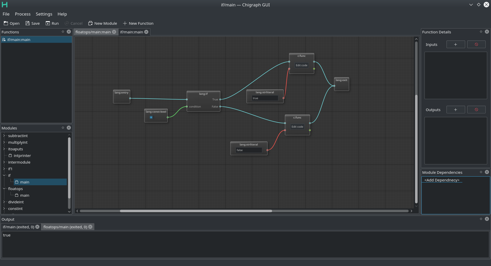
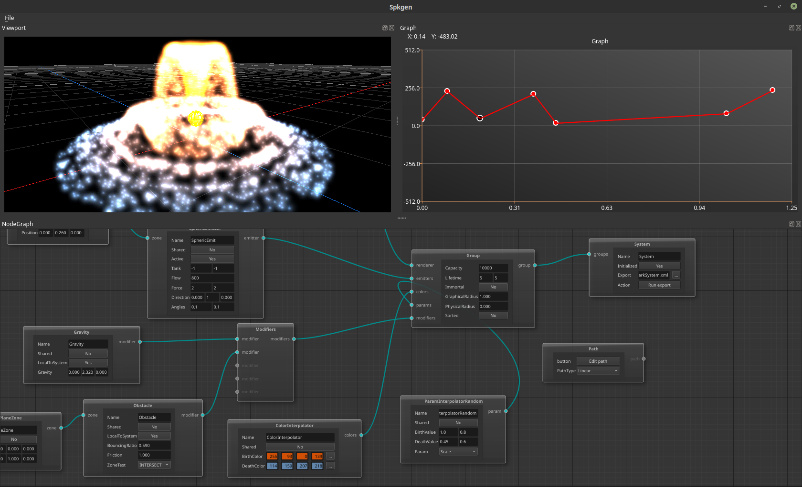

### Purpose

**NodeEditor** is conceived as a general-purpose Qt-based library aimed at
graph-controlled data processing.  Nodes represent algorithms with certain inputs
and outputs. Connections transfer data from the output (source) of the first node
to the input (sink) of the second one.

**NodeEditor** framework is a Visual [Dataflow
Programming](https://en.wikipedia.org/wiki/Dataflow_programming) tool.  A library
client defines models and registers them in the data model registry.  Further
work is driven by events taking place in DataModels and Nodes.  The model
computing is triggered upon arriving of any new input data. The computed result
is propagated to the output connections. Each new connection fetches available
data and propagates is further.

Each change in the source node is immediately propagated through all the
connections updating  the whole graph.

### Platforms

* OSX (Apple Clang - LLVM 3.6), Linux (x64, gcc-7.0, clang-7): 
* Windows (Win32, x64, msvc2017, MinGW 5.3): 

### Dependencies

* Qt >5.2
* CMake 3.2
* Catch2

### Current state

* Model-based nodes
* Automatic data propagation
* Datatype-aware connections
* Embedded Qt widgets
* One-output to many-input connections
* JSON-based interface styles
* Saving scenes to JSON files

### Building

#### Linux

~~~
git clone git@github.com:paceholder/nodeeditor.git
cd nodeeditor
mkdir build
cd build
cmake ..
make -j && make install
~~~

#### Qt Creator

1. Open `CMakeLists.txt` as project.
2. If you don't have the `Catch2` library installed, go to `Build Settings`, disable the checkbox `BUILD_TESTING`.
3. `Build -> Run CMake`
4. `Build -> Build All`
5. Click the button `Run`

### Roadmap

1. Extend set of examples
2. GUI: fix scrolling for scene view window scrolling
3. Implement grouping nodes
4. Split graph and GUI parts
5. Build data propagation on top of the graph code

### Citing

    Dmitry Pinaev et al, Qt5 Node Editor, (2017), GitHub repository, https://github.com/paceholder/nodeeditor

BibTeX

    @misc{Pinaev2017,
      author = {Dmitry Pinaev et al},
      title = {Qt5 Node Editor},
      year = {2017},
      publisher = {GitHub},
      journal = {GitHub repository},
      howpublished = {\url{https://github.com/paceholder/nodeeditor}},
      commit = {1d1757d09b03cea0e4921bc19659465fe6e65b9b}
    }

### Youtube video:

### Now with styles

### Buy me a beer

### Showcase

#### [Chigraph](https://github.com/chigraph/chigraph)

Chigraph is a programming language for beginners that is unique in that it is an
intuitive flow graph:

It features easy bindings to C/C++, package management, and a cool interface.

#### [Spkgen particle engine editor](https://github.com/fredakilla/spkgen)

Spkgen is an editor for the SPARK particles engine using a node-based interface
to create particles effects for games.
