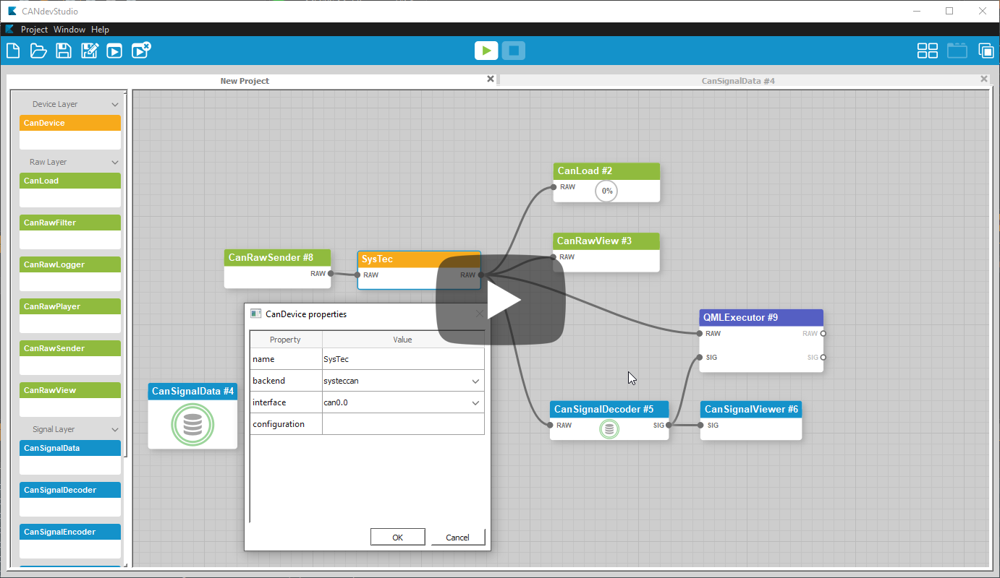

QtNodes
#######

Introduction
============

**QtNodes** is conceived as a general-purpose Qt-based library aimed at
developing Node Editors for various applications. The library could be used for
simple graph visualization and editing or extended further for using the
`Dataflow paradigm <https://en.wikipedia.org/wiki/Dataflow_programming>`_ .

The library is written using the Model-View approach. The whole graph structure
is defined by the user-provided ``GraphModel`` class. It is possible to create or
add Nodes and Connections. The underlying data structures could be of any
arbitrary type or representation.

The ``GraphModel`` could or could not be attached to specialized
``QGraphicsScene`` and ``QGraphicsView`` objects. I.e. the so-called "headless"
`modus operandi` is possible.

.. contents:: Navigation
    :depth: 2

Data Flow Paradigm
==================

The extended model class ``DataFlowGraphModel`` allows to register "processing
algorithms" represented by nodes and is equipped with a set of Qt's signals and
slots for propagating the data though the nodes.

The node's algorithm is triggered upon arriving of any new input data. The
computed result is propagated to the output connections. Each new connection
fetches available data and propagates is further. Each change in the source node
is immediately propagated through all the connections updating the whole graph.

Supported Platforms
===================

* Linux (x64, gcc-7.0, clang-7) |ImageLink|_
* OSX (Apple Clang - LLVM 3.6) |ImageLink|_

.. |ImageLink| image:: https://travis-ci.org/paceholder/nodeeditor.svg?branch=master
.. _ImageLink: https://travis-ci.org/paceholder/nodeeditor

* Windows (Win32, x64, msvc2017, MinGW 5.3) |AppveyorImage|_

.. |AppveyorImage| image:: https://ci.appveyor.com/api/projects/status/wxp47wv3uyyiujjw/branch/master?svg=true
.. _AppveyorImage: https://ci.appveyor.com/project/paceholder/nodeeditor/branch/master)

Dependencies
============

* Qt >5.2
* CMake 3.2
* Catch2

Current State
=============

* Model-based nodes
* Automatic data propagation
* Datatype-aware connections
* Embedded Qt widgets
* One-output to many-input connections
* JSON-based interface styles
* Saving scenes to JSON files

Building
========

Linux
^^^^^

::

  git clone git@github.com:paceholder/nodeeditor.git
  cd nodeeditor
  mkdir build
  cd build
  cmake ..
  make -j && make install

Qt Creator
^^^^^^^^^^

1. Open `CMakeLists.txt` as project.
2. If you don't have the `Catch2` library installed, go to `Build Settings`, disable the checkbox `BUILD_TESTING`.
3. `Build -> Run CMake`
4. `Build -> Build All`
5. Click the button `Run`

>>> Version 3 Roadmap <<<
=========================

#. Headless mode. [done]
   You can create, populate, modify the derivative of AbstractGraphModel
   without adding it to the actual Flow Scene.
   The library is now designed to be general-purpose graph
   visualization and modification tool, without specialization on only
   data propagation.
#. Build data propagation on top of the graph code [done].

   #. Fix old unit-tests. [in progress].
   #. Fix save/restore. [done].
   #. Fix CI scriptst on travis and appveyor. [partially done].

#. Backward compatibility with Qt5 [not started/help needed].
#. Write improved documentation based on Sphynx platform [done].
#. Extend set of examples [partially done].
#. Undo Redo [done].
#. Delegate Node Painter [not started].
#. Vertical Node/Connection Layout.
#. Python wrappring using PySide [HELP NEEDED].
#. Implement grouping nodes [not started].

Any suggestions are welcome!

Citing
======

::

    Dmitry Pinaev et al, Qt5 Node Editor, (2017), GitHub repository, https://github.com/paceholder/nodeeditor

BibTeX::

    @misc{Pinaev2017,
      author = {Dmitry Pinaev et al},
      title = {QtNodes. Node Editor},
      year = {2017},
      publisher = {GitHub},
      journal = {GitHub repository},
      howpublished = {\url{https://github.com/paceholder/nodeeditor}},
      commit = {1d1757d09b03cea0e4921bc19659465fe6e65b9b}
    }

Support
=======

If you like the project you could donate me on PayPal |ImagePaypal|_

.. |ImagePaypal| image:: https://img.shields.io/badge/Donate-PayPal-green.svg
.. _ImagePaypal: https://www.paypal.com/paypalme/DmitryPinaev

If you send more than $100, I'll forward $100 to some fund supporting sick
children and report to you back.

Showcase
========

Youtube videos
^^^^^^^^^^^^^^

.. image:: https://img.youtube.com/vi/pxMXjSvlOFw/0.jpg
   :target: https://www.youtube.com/watch?v=pxMXjSvlOFw

|

.. image:: https://img.youtube.com/vi/i_pB-Y0hCYQ/0.jpg
   :target: https://www.youtube.com/watch?v=i_pB-Y0hCYQ

CANdevStudio
^^^^^^^^^^^^

`CANdevStudio <https://github.com/GENIVI/CANdevStudio>`_ is a cost-effective,
cross-platform replacement for CAN simulation software. CANdevStudio enables to
simulate CAN signals such as ignition status, doors status or reverse gear by
every automotive developer. Thanks to modularity it is easy to implement new,
custom features.

Chigraph
^^^^^^^^

`Chigraph <https://github.com/chigraph/chigraph>`_ is a visual programming
language for beginners that is unique in that it is an intuitive flow graph:

.. image:: pictures/chigraph.png

It features easy bindings to C/C++, package management, and a cool interface.

Spkgen particle editor
^^^^^^^^^^^^^^^^^^^^^^

`Spkgen <https://github.com/fredakilla/spkgen>`_ is an editor for the SPARK
particles engine that uses a node-based interface to create particles effects for
games

.. image:: pictures/spkgen.png
