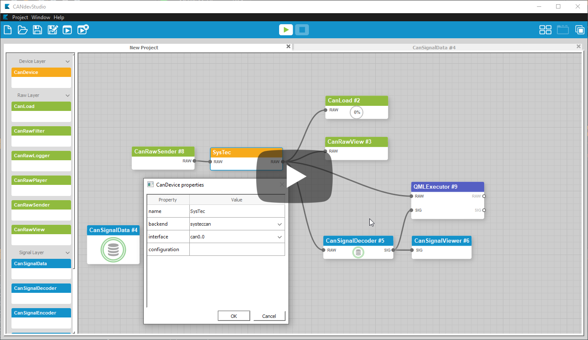
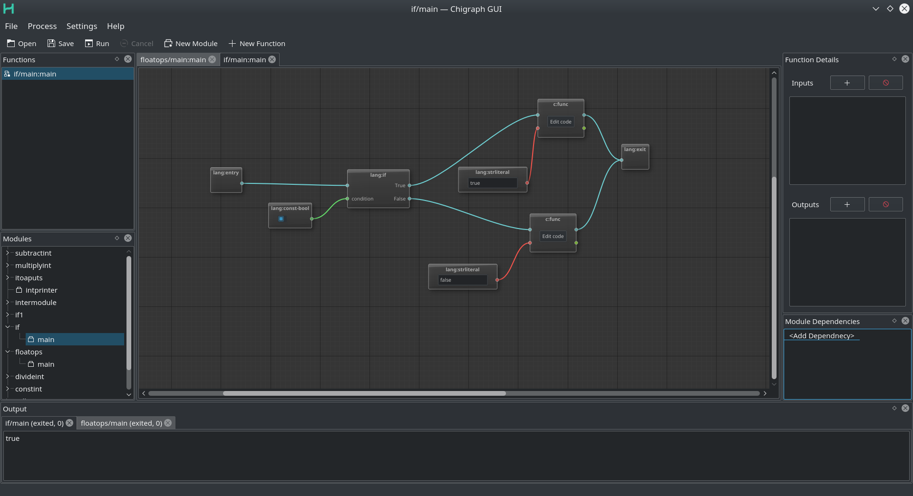
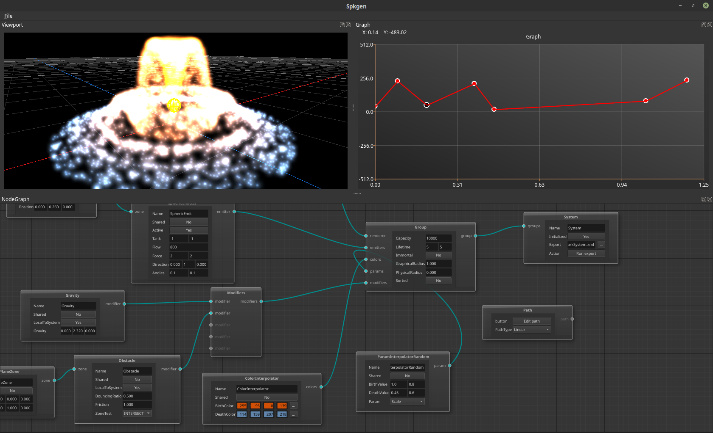

QtNodes
#######

Introduction
============

**QtNodes** is conceived as a general-purpose Qt-based library aimed at
developing Node Editors for various applications. The library could be used for
simple graph visualization and editing or extended further for using the
`Dataflow paradigm <https://en.wikipedia.org/wiki/Dataflow_programming>`_ .

The library is written using the Model-View approach. The whole graph structure
is defined by a class derived from ``AbstractGraphModel``.  It is possible to
create or add Nodes and Connections. The underlying data structures could be of
any arbitrary type or representation.

An instance of ``AbstractGraphModel`` could or could not be attached to
specialized ``QGraphicsScene`` and ``QGraphicsView`` objects. I.e. the so-called
"headless" `modus operandi` is possible.

Documentation
=============

`Read the Docs for QtNodes <https://qtnodes.readthedocs.io/>`_

Warning
  Many classes were changed in the version ``3.0``. If you had a large project
  based on ``2.x.x``, make sure you read the documentation first and see the
  examples before checking out the new code.

Branches
--------

There are branchses ``v2`` and ``v3`` for versions ``2.x.x`` and ``3.x``
respectively. The branch ``master`` contains the latest dev state.

.. contents:: Navigation
    :depth: 2

Data Flow Paradigm
==================

The extended model class ``DataFlowGraphModel`` allows to register "processing
algorithms" represented by nodes and is equipped with a set of Qt's signals and
slots for propagating the data though the nodes.

The node's algorithm is triggered upon arriving of any new input data. The
computed result is propagated to the output connections. Each new connection
fetches available data and propagates is further. Each change in the source node
is immediately propagated through all the connections updating the whole graph.

Supported Environments
======================

Platforms
---------

* Linux (x64, gcc-7.0, clang-7) |ImageLink|_
* OSX (Apple Clang - LLVM 3.6) |ImageLink|_

.. |ImageLink| image:: https://travis-ci.org/paceholder/nodeeditor.svg?branch=master
.. _ImageLink: https://travis-ci.org/paceholder/nodeeditor

* Windows (Win32, x64, msvc2017, MinGW 5.3) |AppveyorImage|_

.. |AppveyorImage| image:: https://ci.appveyor.com/api/projects/status/wxp47wv3uyyiujjw/branch/master?svg=true
.. _AppveyorImage: https://ci.appveyor.com/project/paceholder/nodeeditor/branch/master)

Dependencies
------------

* Qt >5.15
* CMake 3.8
* Catch2

Current State (v3)
==================

* Model-based graph
* Headless mode
  You can create, populate, modify the derivative of ``AbstractGraphModel``
  without adding it to the actual Flow Scene.  The library is now designed to be
  general-purpose graph visualization and modification tool, without
  specialization on only data propagation.
* Automatic data propagation built on top of the graph-model code
  The library could be used for both pure graph visualization purposes and for
  originally implemented data propagation.
* Dynamic ports
* Datatype-aware connections
* Embedded Qt widgets
* One-output to many-input connections
* JSON-based interface styles
* Saving scenes to JSON files
* Custom Node Geometry
* Vertical and Horizontal graph layouts
* Undo/Redo, Duplication (CTRL+D)

Building
========

Linux
-----

::

  git clone git@github.com:paceholder/nodeeditor.git
  cd nodeeditor
  mkdir build
  cd build
  cmake ..
  make -j && make install

Qt Creator
----------

1. Open `CMakeLists.txt` as project.
2. If you don't have the `Catch2` library installed, go to `Build Settings`, disable the checkbox `BUILD_TESTING`.
3. `Build -> Run CMake`
4. `Build -> Build All`
5. Click the button `Run`

With Cmake using `vcpkg`
^^^^^^^^^^^^^^^^^^^^^^^^

1. Install `vcpkg`
2. Add the following flag in configuration step of `CMake`

::

   -DCMAKE_TOOLCHAIN_FILE=<vcpkg_dir>/scripts/buildsystems/scripts/buildsystems/vcpkg.cmake

Help Needed
===========

#. Python wrappring using PySide.
#. QML frontend.
#. Wirting a ClangFormat config.

Any suggestions are welcome!

Contribution
============

#. Be polite, respectful and collaborative.
#. For submitting a bug:

   #. Describe your environment (Qt version, compiler, OS etc)
   #. Describe steps to reproduce the issue

#. For submitting a pull request:

   #. Create a proposal task first. We can come up with a better design together.
   #. Create a pull-request. If applicable, create a simple example for your
      problem, describe the changes in details, provide use cases.

#. For submitting a development request:

   #. Describe your issue in details
   #. Provide some use cases.

#. I maintain this probject in my free time, when I am not busy with my work or
   my family. **If I do not react or do not answer for too long, please ping
   me**.

Citing
======

::

    Dmitry Pinaev et al, Qt Nodes, (2022), GitHub repository, https://github.com/paceholder/nodeeditor

BibTeX::

    @misc{Pinaev2022,
      author = {Dmitry Pinaev et al},
      title = {QtNodes. Node Editor},
      year = {2017},
      publisher = {GitHub},
      journal = {GitHub repository},
      howpublished = {\url{https://github.com/paceholder/nodeeditor}},
      commit = {877ddb8c447a7a061a5022e9956a3194132e3dd9}
    }

Support
=======

If you like the project you could donate me on PayPal |ImagePaypal|_

.. |ImagePaypal| image:: https://img.shields.io/badge/Donate-PayPal-green.svg
.. _ImagePaypal: https://www.paypal.com/paypalme/DmitryPinaev

If you send more than $100, I'll forward $100 to some fund supporting sick
children and report to you back.

Thanks
======

The version 3 was released with a generous help of
`Davide Faconti <https://github.com/facontidavide>`_

Showcase
========

Youtube videos
--------------

.. image:: https://img.youtube.com/vi/pxMXjSvlOFw/0.jpg
   :target: https://www.youtube.com/watch?v=pxMXjSvlOFw

|

.. image:: https://img.youtube.com/vi/i_pB-Y0hCYQ/0.jpg
   :target: https://www.youtube.com/watch?v=i_pB-Y0hCYQ

CANdevStudio
------------

`CANdevStudio <https://github.com/GENIVI/CANdevStudio>`_ is a cost-effective,
cross-platform replacement for CAN simulation software. CANdevStudio enables to
simulate CAN signals such as ignition status, doors status or reverse gear by
every automotive developer. Thanks to modularity it is easy to implement new,
custom features.

Chigraph
--------

`Chigraph <https://github.com/chigraph/chigraph>`_ is a visual programming
language for beginners that is unique in that it is an intuitive flow graph:

It features easy bindings to C/C++, package management, and a cool interface.

Spkgen particle editor
----------------------

`Spkgen <https://github.com/fredakilla/spkgen>`_ is an editor for the SPARK
particles engine that uses a node-based interface to create particles effects for
games

